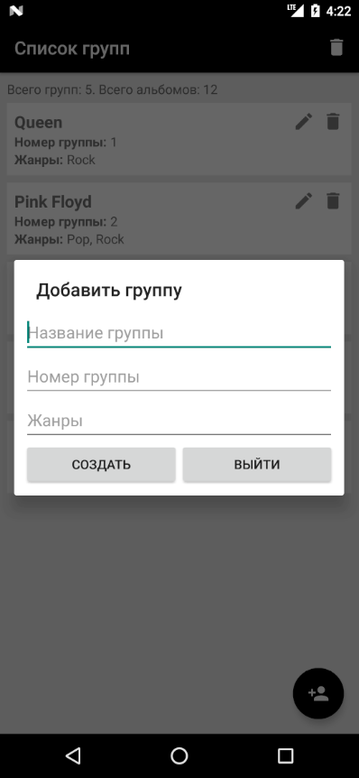
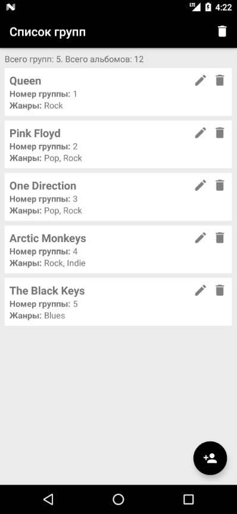
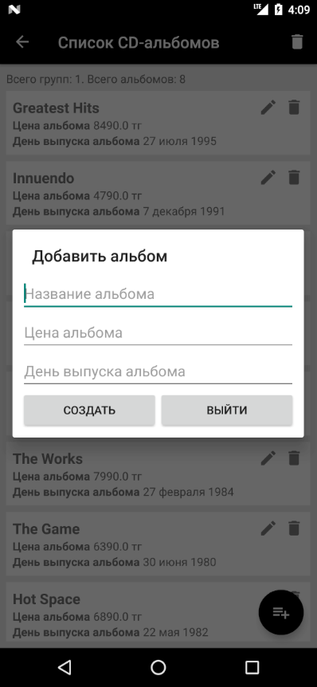
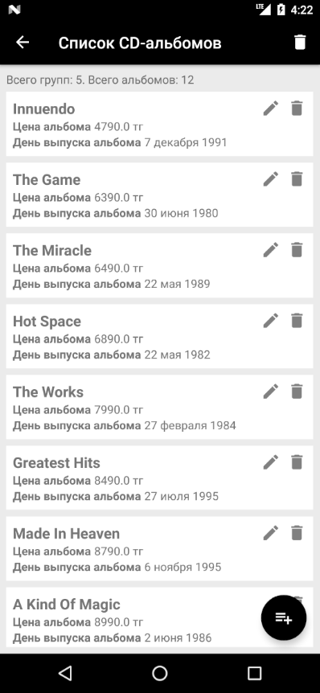

# BMK01_CourseProject
## Разработка программ для мобильных устройств
## Курсовая работа за 6 семестр
Разработка многооконного мобильного приложения для Android с использованием базы данных SQLite
### Вариант №1 - Музыкальные компакт-диски CD/DVD

## Добавление группы

## Список групп

## Добавление альбома

## Список альбомов
